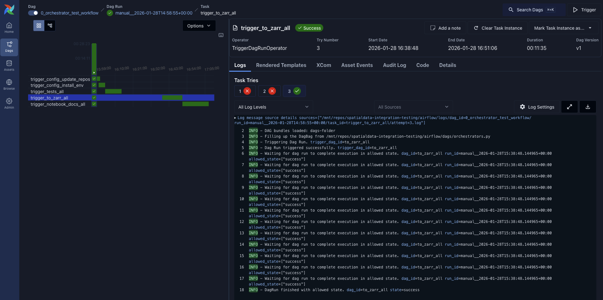

# spatialdata-data-converter

Automated pipeline for the end-to-end testing of the SpatialData framework, the conversion of sample datasets and the upload of the converted datasets to S3.

## How to use this repository

This repository contains a series of scripts that can be orchestrated with Airflow (recommended) or run manually.

**Recommended: Airflow.** 
- Remote execution. A machine connected to the internet to which the team has secure access runs Airflow 24/7 and provides a continuously up-to-date status on the health of the SpatialData framework. The Airflow pipeline is configured to use a parallel executor.
- Local execution. Easier when developing and quickly testing locally, for instance before a code release (since our remote machine is currently less powerful than a beefed up Apple Silicon MacBook Pro).

**Alternative approaches:**
- Manual execution, sequentially. Run jobs in a series of bash scripts. Simple to understand, to run, to debug.
- Manual execution, parallelized. Run jobs in parallel using a simple bash function to spin multiple processes. Simple and fast. More fragile than a sequential run.

## Motivation
- Why Airflow and not GitHub Actions? Cost, speed, configurability, debuggability. This pipeline requires no warmup (datasets are alredy downloaded and we can reuse environments if we want), we can express complex workflows, and also we can easily get more storage, CPU, memory and even GPU if needed. Finally debugging problems locally it's smoother than on GitHub Actions.
- Limitations of Airflow: GitHub Actions offer a simpler experience. So we could consider moving lightweights tasks to GitHub Actions and keep the Airflow pipeline only for heavy/complex workflows.
- Alternatives to Airflow: Flyte, Prefect, Nextflow. We chose Airflow because it's both very mature and free.

## Usage instructions (Airflow)
If you have access to remote machine, everything is already setup.

### Running the workflows

1. **First run (initial setup, already performed).**

    Run the orchestrator DAG `0_orchestrator_first_run` which automatically executes the following sequence:
    1. `config_update_repos`
    2. `config_create_symlinks`
    3. `config_install_env`
    4. `download_all`

2. **Testing workflow (before releases).**

    Run the orchestrator DAG `0_orchestrator_test_workflow` which automatically executes the following sequence:
    1. `config_update_repos` (ensure repos are up-to-date)
    2. `config_install_env` (ensure environment is current)
    3. `tests_all`
    4. `to_zarr_all`
    5. `notebook_docs_all`

    Each stage waits for all jobs from the previous stage to complete before starting. Jobs within each stage run in parallel.

3. **Upload data (right before a release).**

    Upload is done manually via the command line (not via Airflow). Once tests pass and you are ready to release, upload the data right before making the release:
    ```bash
    bash src/spatialdata_data_converter/workflow_update_data_for_release.sh <spatialdata-version> <spatialdata-io-version>
    ```
    After the upload is successful, manually add the new version entry in `dependencies/spatialdata-notebooks/datasets/README.md` so that the download link appears in the docs.

**Notes:**
- The `update_dev_dataset` DAG will run automatically daily, so there's no need to manually trigger it (it is not triggered by the above).
- You can also run individual DAGs manually if needed (e.g., `tests_spatialdata`, `to_zarr_xenium_rep1_io`).
- If some jobs fail, you can manually retrigger the failed jobs using the Airflow UI, by pressing the "Clear" button (⟳).

## Installation (Airflow)

### Prerequisites
1. Clone the repository, including the submodules:
    ```bash
    git clone --recurse-submodules https://github.com/scverse/spatialdata-integration-testing.git
    ```

2. Go to the cloned directory:
    ```bash
    cd spatialdata-integration-testing
    ```

3. Install the `pixi` environment (you need to have `pixi` available in your system):
    ```bash
    pixi install
    pixi update
    ```

4. Copy `template_envvars.sh` into `envvars.sh` and update the paths as explained in the comments in that file.

### Airflow setup
1. Configure the Airflow home directory.
In your `~/.zshrc` file (or depending on your system `~/.bashrc`, `~/.bash_profile`, ...), add the following lines (remember to change the path):
```bash
export AIRFLOW_HOME=/absolute/path/to/spatialdata-integration-testing/airflow
```

2. Run Airflow
```bash
pixi run airflow standalone
```
When running the command above for the first time, it creates a configuration file in `$AIRFLOW_HOME/airflow.cfg`. After creating the configuration, the command starts the webserver and the scheduler.

3. Manually change the configuration.
Set
```python
load_examples = False
page_size = 100
scheduler_heartbeat_sec = 2
scheduler_idle_sleep_time = 0.5
```
You may have to delete the database file `$AIRFLOW_HOME/airflow.db` to clean up the example DAGs if they still appear in the UI.

4. Open the dashboard.

   In your browser and go to `http://localhost:8080` to access the Airflow webserver.
   If it doesn't work, check the terminal output for the correct port.

5. Login.

    For username and password follow the instructions printed in the terminal: search for "standalone | Password for the admin user has been previously generated in" or something similar.

## Usage (Manual execution)

You may find it easier to run single jobs manually, but to run the whole workflow we recommend using Airflow.


### Prerequisites

Follow the prerequisites from the [Installation (Airflow)](#installation-airflow) section above.

### Running the workflows

1. Run `workflow_first_run.sh` with
    ```bash
    bash src/spatialdata_data_converter/workflow_first_run.sh
    ````
   This will run a small set of commands sequentially.

2. If your script fails (it should not, but there is some chance it will):
    - Comment out what worked to avoid re-running everything.
    - Fix what didn't work.
    - Run the script again from where it failed.
    - Continue like this until the script finishes successfully.
    - Please commit and push the fixes, or at minimum report them.

3. Now there is a good chance that things work, you are ready to run the real thing!
   This is the script that you should run before making a release. The jobs will be run in parallel. On a multi-core ubuntu machine the parallel version takes 15 mins, the non parallel would take (I think) more than 1 hour.
    ```bash
   bash src/spatialdata_data_converter/workflow_before_release.sh
   ```
   If it passes, you are ready to make a release! If it doesn't pass, debug things like before.
   You can either comment out lines from the script above, or if you want to run things sequentially you can
   manually comment/uncomment out lines in the script `invoke_cli.sh` (which contains all the commands, even the one you don't need) and run it with:
    ```bash
    bash src/spatialdata_data_converter/invoke_cli.sh
    ```

4. Right before making a release, upload the new datasets to S3 by running:
    ```bash
    bash src/spatialdata_data_converter/workflow_update_data_for_release.sh <spatialdata-version> <spatialdata-io-version>
    ```
    After the upload is successful, manually add the new version entry in `dependencies/spatialdata-notebooks/datasets/README.md` so that the download link appears in the docs.
## Future improvements
### Upload process
- [ ] The `spatialdata-io` version should be added to the `sdata.zarr` metadata.
- [ ] The upload script should read the `spatialdata` version and `spatialdata-io` version from the metadata.
- [ ] The upload task should be re-added to the DAG.
- [ ] There should still be the optoin to run the upload manually before making a release.

## Some screenshots

### DAG list for manual execution, schedule and status


### "Test workflow" DAG


### "To Zarr" DAG


### History of runs for each DAG


### Latest DAG runs


### Gantt chart for the "Test workflow" DAG

